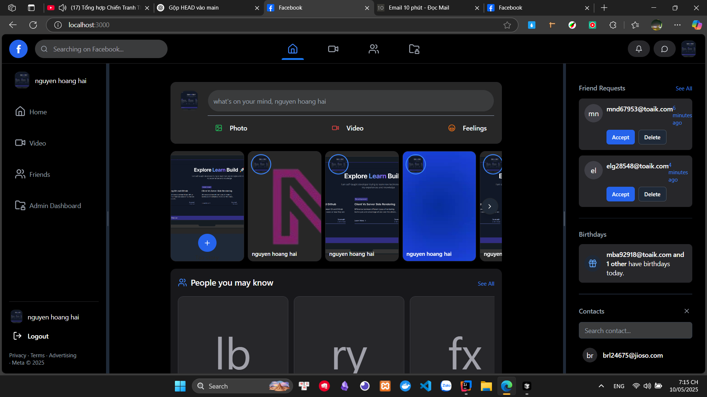
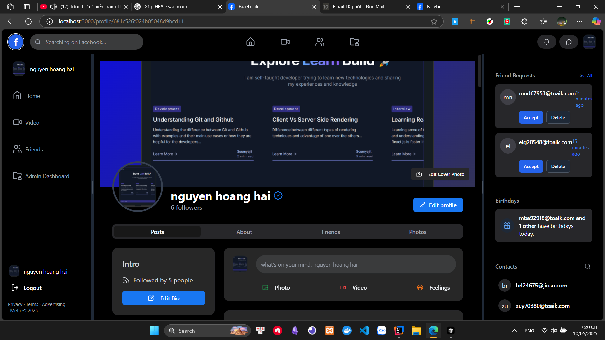
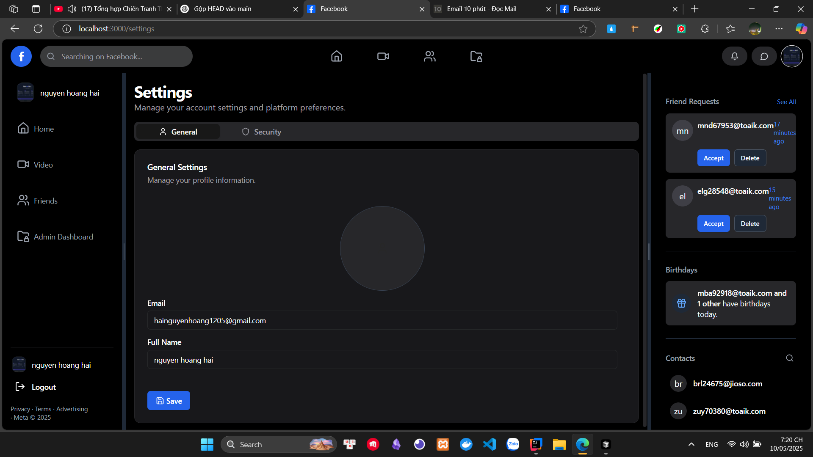
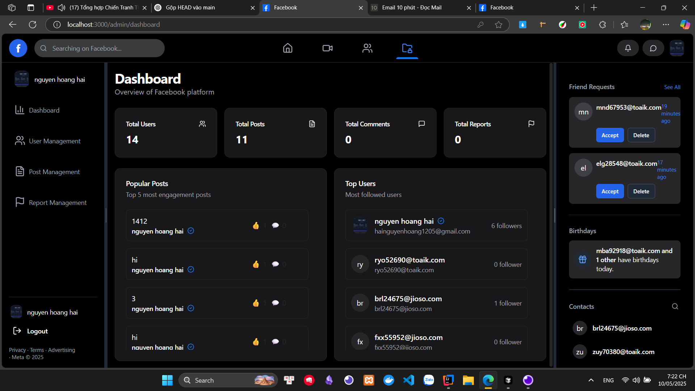
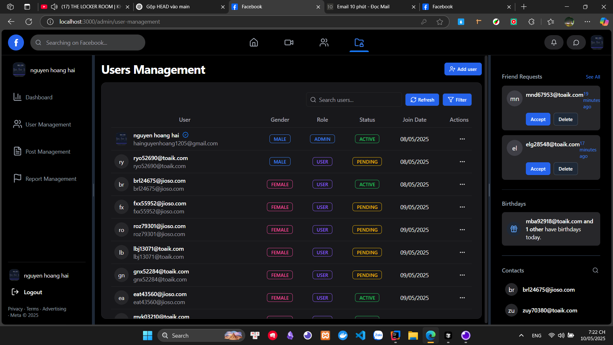
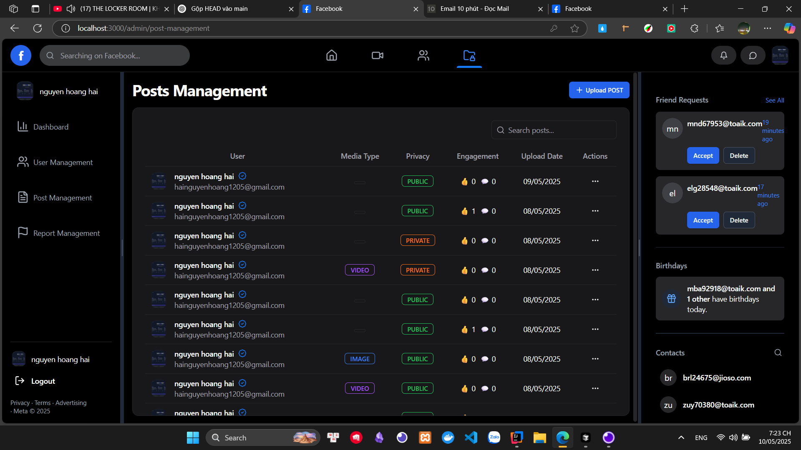
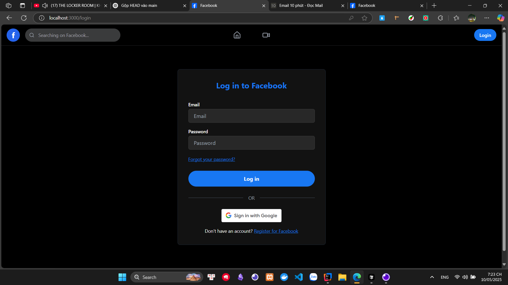
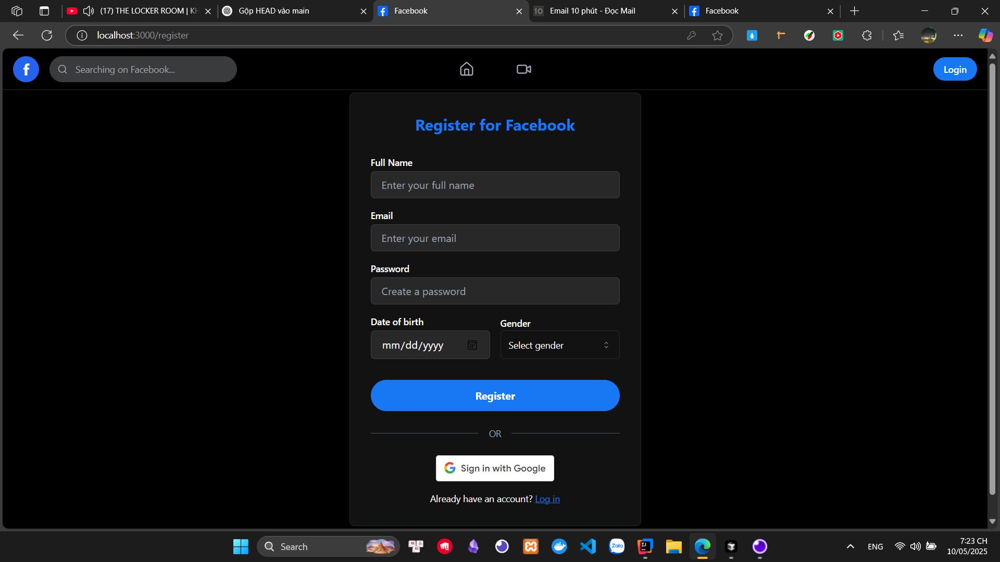
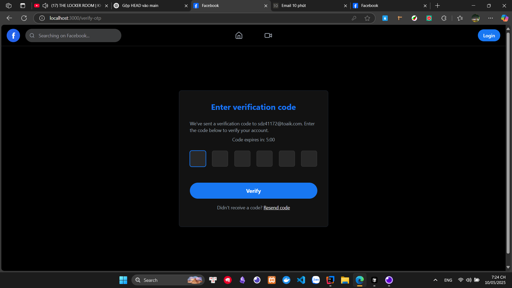
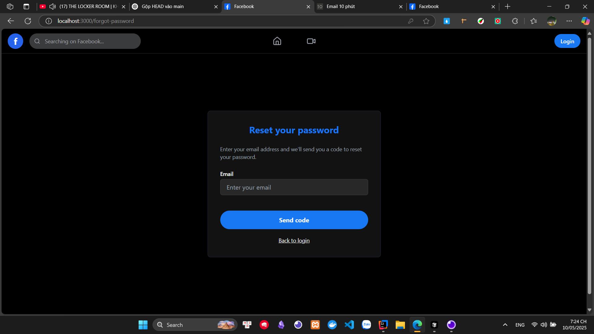

# Facebook Clone

## Overview

**Facebook Clone** is a full-featured social networking web application inspired by Facebook. It supports features like posting statuses, stories, user and post management, and more.

- 📚 Admin dashboard for management
- 🔍 Search for users
- ❤️ Like, share, and comment on posts
- 👤 User profiles
- 🔐 Full authentication system
- 💬 Real-time chat between users
- 📱 Responsive UI design

## Technologies Used

## Frontend

- **React 18** – A powerful frontend framework for SPA.
- **React DOM** – A library to connect React with the DOM.
- **React Router DOM** – Client-side routing.
- **React Hook Form** – Efficient form management.
- **React Toastify / Hot Toast** – Display toast notifications.
- **Framer Motion** – Animation for React components.
- **Emoji Picker React** – Emoji picker for the UI.
- **React Icons / Lucide React** – Lightweight and easy-to-use icon libraries.
- **React Resizable Panels** – UI layout that can be resized.
- **Zustand** – Simple and lightweight state management, a lighter alternative to Redux.

## UI / Styling

- **Tailwind CSS** – A utility-first CSS framework for building UI designs.
- **Tailwind Scrollbar Hide** – Plugin to hide the scrollbar.
- **Tailwind Merge** – Conditionally merge Tailwind classes.
- **Tailwind CSS Animate** – Plugin for adding animation effects.
- **clsx** – Combine classNames conditionally.
- **Class Variance Authority** – Organize classes for components.

## Component UI Framework

- **Radix UI (React)** – A headless UI component library (fully customizable).
- **@headlessui/react** – Flexible UI components for Tailwind/React.

## Form / Validation / Auth

- **@react-oauth/google** – OAuth login with Google.
- **jwt-decode** – Decode JWT tokens.

## Utility Libraries

- **Lodash** – A popular utility functions library.
- **Axios** – HTTP client for making requests.

## Time / Date

- **date-fns** – Easy and efficient handling of dates and times.

## Realtime / WebSocket

- **Socket.IO Client** – Real-time communication.
- **SockJS Client** – WebSocket fallback.
- **Simple-Peer** – Peer-to-peer communication via WebRTC.
- **@stomp/stompjs** – WebSocket communication using the STOMP protocol.

## Dev Tools

- **TypeScript** – A statically typed language on top of JavaScript.
- **Vite** – A super-fast build tool for the frontend.
- **ESLint** – Linting tool to catch errors early.
- **@vitejs/plugin-react** – React support plugin for Vite.

## Installation

### Prerequisites

- Node.js version 18.x or above
- npm or yarn

### Steps

1. Clone the repository and navigate to the frontend folder:

```bash
git clone https://github.com/Hai1205/Facebook_Client.git
cd Facebook_Client
```

2. Install dependencies:

```bash
npm install
```

3. Create and configure a `.env` file with the following variables:

```env
VITE_SERVER_URL=
VITE_SOCKET_URL=
VITE_CLIENT_ID=
VITE_CLIENT_URL=
```

4. Run the development server:

```bash
npm run dev
```

The frontend will be available at [http://localhost:3000](http://localhost:3000)

## Artwork

### Home Page



### Profile Page



### Settings Page



### Admin Dashboard Page



### User Management Page



### Post Management Page



### Login Page


### Register Page



### Verify Page



### Reset Password Page



## Team Members

| Student ID | Full Name        |
| ---------- | ---------------- |
| 3122410095 | Nguyen Hoang Hai |
| 3122410117 | Nguyen Van Hieu  |
| 3122410365 | Doan Tuan Tai    |
